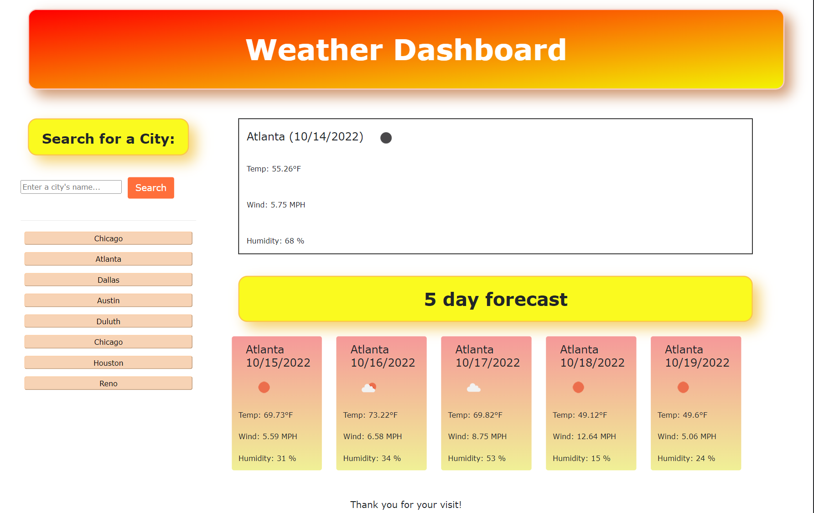

# weather-forcast

## Description

This is a weather dashboard. It is used to retrieve weather data for cities.

## Installation

N/A

## Usage

Link: 

Once the page is accessed, the user can type a city's name inside the input field, and click "Search". The page will present current and 5-day future conditions for that chosen city, and that city is added to the search history. This weather application will inform the user with the date, an icon representation of weather conditions, the temperature, the humidity, and the wind speed. When the user clicks on a city in the search history, they will then be presented with current and future conditions for that city again.

## Credits

N/A

## License

N/A

## Badges

N/A

## Features

N/A

## How to Contribute

N/A

## Tests

N/A